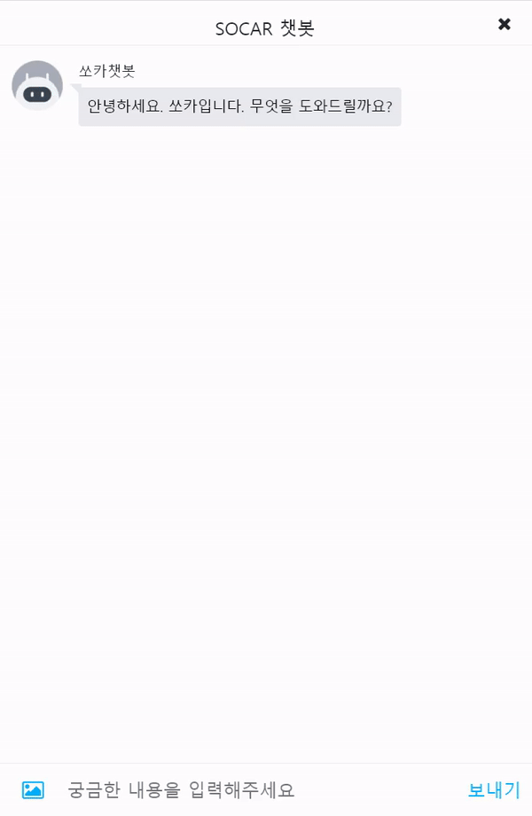
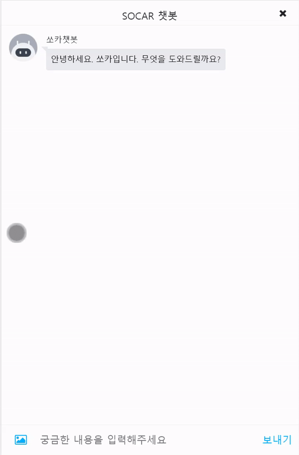

# [AIFFEL X SOCAR] 생성형 멀티모달 챗봇


※ 본 프로젝트는 모두의연구소 AIFFEL SOCAR 3기의 활동으로 쏘카의 실제 데이터를 기반으로 진행하였습니다.  
따라서 보안 협약에 의해 데이터를 비식별 처리 하였음을 알려드립니다.

## Structure

```
Folder/
|- CV/           # U-Net++ model (py)
|- DATA/         # Data Setting, FAQ data, stopword (ipynb, txt)
|- EDA/          # WordCloud EDA (ipynb)
|- KeyBERT/      # Keyword extract KeyBERT model (ipynb)
|- KoBART/       # KoBART model (py)
|- KoDialoGPT/   # KoDialoGPT model (ipynb, py)
|- Metric/       # Bert score setting (ipynb)
|- reference/    # Poster, Demon (pdf, gif)
```

## **요약**

- 현재 쏘카의 고객문의 챗봇을 개선하기 위해, 관련 데이터로 학습한 생성형 챗봇을 만들어 사용자 편의를 높임
- NLP로 사용자의 문의를 해석하고 답변을 생성하는 부분을 구현
- CV, Image2Text를 통해 고객이 올린 사진을 인식하여 문제에 대한 분류를 구현
- 고객과 채팅, 업로드된 이미지를 기반으로 필요한 답을 생성하는 챗봇 구현

## **역할**

- 쏘카 메모 데이터에서 **키워드를 추출**하고 **생성형 모델 KoDialoGPT 구현**
- 쏘카 홈페이지에서 FAQ **데이터 수집**


## 시연 영상
 

## 팀명 
**OOPS!**

## 프로젝트 기간
- 2022.12.26 ~ 2023.02.08


## **Member**
- [김종태](https://github.com/happybell80)
- [김태종](https://github.com/xowhddk123)
- [노현호](https://github.com/nhh2907)
- [박수진](https://github.com/darkhairlove)
- [황한용](https://github.com/hwangsae91)


## Comments
[느낀점](https://www.notion.so/data--scientist/AIFFEL-X-SOCAR-e15b894c6dee4fff82fafa70184cc1ce?pvs=4#f3d4c80455b645ab85b66fca3174cbc7)
